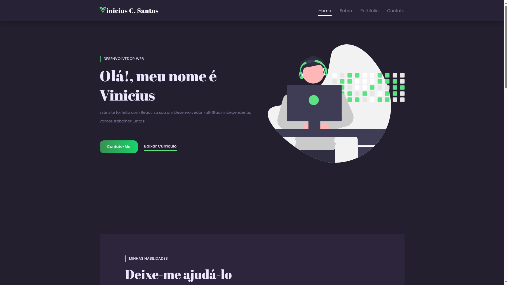
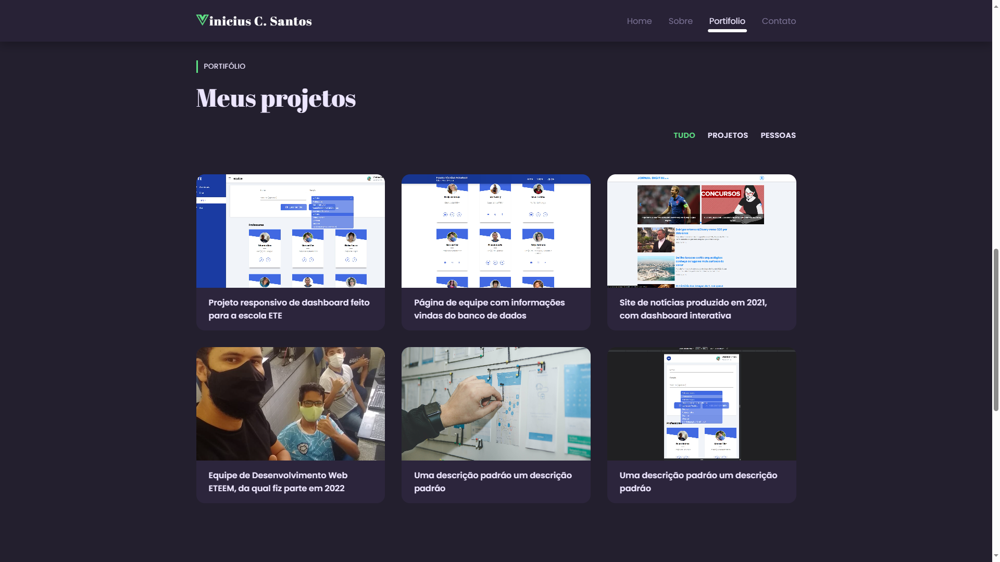
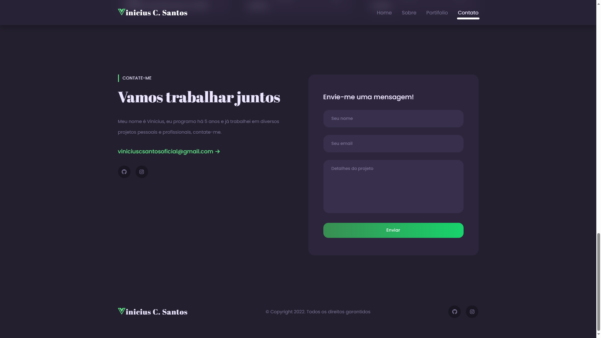

<h1 align="center" style="font-weight: bold;">Portfolio ✍</h1>

<b>Esta aplicação representa meu portfolio desenvolvido em React, onde você pode explorar alguns dos projetos que realizei.
</b>

    
    
    

